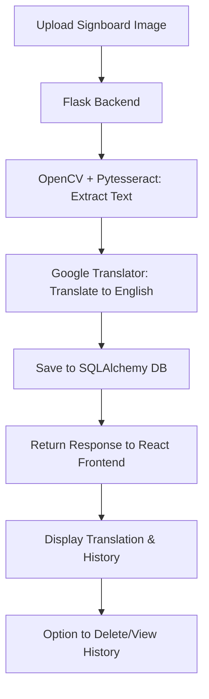

# 🌐 Signboard Translator
A full-stack web application that allows users to upload signboard images, extract the text from them using OCR, and translate the text into **English**.  
The app also stores translation history in a database so users can view or delete previous translations.
---
## ✨ Features
- 📷 Upload an image of a signboard.  
- 🔎 Detect and extract text using **OpenCV** + **Pytesseract (OCR)**.  
- 🌍 Translate extracted text into English using **Google Translator**.  
- 🗂️ Maintain translation history in a **SQLAlchemy** database.  
- 🗑️ Delete or view past translations by session.  
- 🎨 Responsive and modern UI built with **React + Tailwind CSS**.  
---
## 🛠️ Tech Stack
**Frontend:**
- ⚛️ React.js  
- 🎨 Tailwind CSS  
**Backend:**
- 🐍 Flask  
- 🗄️ SQLAlchemy (for database & session history)  
**Image Processing & OCR:**
- 📷 OpenCV  
- 📝 Pytesseract  
**Translation:**
- 🌐 Google Translator  
**Other Tools:**
- 🐙 Git & GitHub for version control  
- 🔄 Flask-Migrate for DB migrations  
---
## 🔄 Workflow
Here's how the application works step by step:
1. **User uploads an image** via the React frontend.  
2. The image is sent to the **Flask backend**.  
3. **OpenCV** processes the image for better OCR accuracy.  
4. **Pytesseract** extracts the text from the processed image.  
5. The extracted text is translated into **English** using Google Translator.  
6. Both the input text & translation are stored in a **SQLAlchemy DB** for the session.  
7. The frontend fetches and displays the translated text along with **history**.  
8. Users can **view or delete** translations from their history.  


---

## 🚀 Getting Started

### Prerequisites
- Python 3.8+
- Node.js 14+
- npm or yarn

### 📥 Clone Repository
```bash
git clone https://github.com/arooshv9/signboard_translator.git
cd signboard_translator
```

### 🔧 Backend Setup
```bash
cd backend
```

**Create virtual environment:**
```bash
python -m venv venv
```

**Activate virtual environment:**
```bash
# On macOS/Linux:
source venv/bin/activate

# On Windows:
venv\Scripts\activate
```

**Install dependencies:**
```bash
pip install -r requirements.txt
```

**Run database migrations:**
```bash
flask db upgrade
```

**Start Flask server:**
```bash
python app.py
```

### ⚛️ Frontend Setup
```bash
cd frontend
```

**Install dependencies:**
```bash
npm install
```

**Start React development server:**
```bash
npm start
```

### 🌐 Access Application
```
Frontend: http://localhost:3000
Backend API: http://localhost:5000
```

---

## 📂 Project Structure
```
signboard_translator/
│
├── backend/                 # Flask backend
│   ├── app.py               # Main Flask app
│   ├── migrations/          # Alembic migrations
│   ├── models.py            # SQLAlchemy models
│   ├── utils/               # Image processing helpers
│   └── requirements.txt     # Python dependencies
│
├── frontend/                # React frontend
│   ├── src/                 # Components & logic
│   ├── public/              # Static files
│   └── package.json         # Frontend dependencies
│
└── README.md                # Documentation
```
